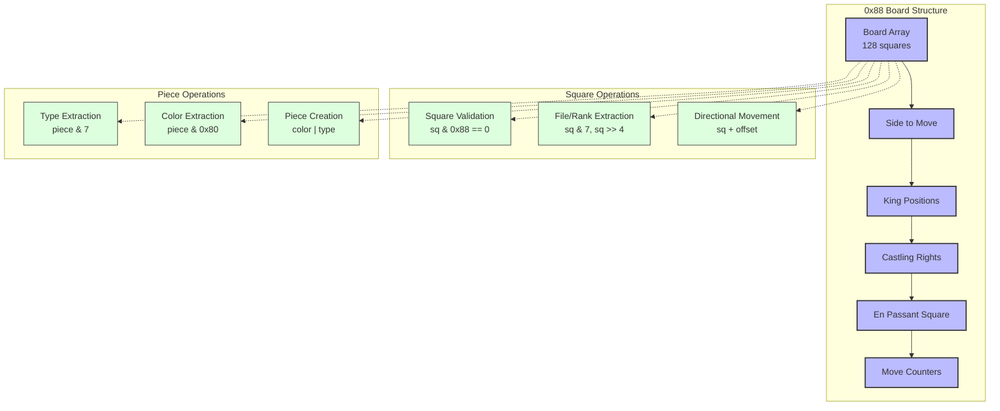

# 0x88 Board Representation Design

## Overview

eZ80 Chess uses the 0x88 board representation method for efficient move validation and piece tracking. This document explains the design decisions, memory layout, and performance characteristics of this representation.

## Memory Layout

The board is represented as a 16x8 array (128 squares), where only half the squares are valid chess positions. This layout enables efficient move validation through bitwise operations.

```
Internal Square Numbering:

    a  b  c  d  e  f  g  h
    -----------------------﹁
8 |  0  1  2  3  4  5  6  7 | 8
7 | 16 17 18 19 20 21 22 23 | 7
6 | 32 33 34 35 36 37 38 39 | 6
5 | 48 49 50 51 52 53 54 55 | 5
4 | 64 65 66 67 68 69 70 71 | 4
3 | 80 81 82 83 84 85 86 87 | 3
2 | 96 97 98 99¹00¹01¹02¹03 | 2
1 |¹12¹13¹14¹15¹16¹17¹18¹19 | 1
    -----------------------
    a  b  c  d  e  f  g  h

Invalid squares have indices where ((index & 0x88) != 0).
```

### Key Data Structures

#### Square Representation

```c
/**
 * @brief Square representation in 0x88 format
 *
 * Binary layout: 0bxrrr_xfff
 * - rrr: Rank (0-7) ==> bits 4-6
 * - fff: File (0-7) ==> bits 0-2
 * - x: Validity bit ==> bits 3,7 (forms 0x88 when invalid)
 */
typedef uint8_t square_t;
```

#### Piece Representation

```c
/**
 * @brief Piece representation combining color and type
 *
 * Binary layout: 0bc000_0ttt
 * - c: Color (0/1) ==> bit 7
 * - ttt: Type (0-6) ==> bits 0-2
 */
typedef uint8_t piece_t;
```

#### Board Structure

```c
/**
 * @brief Complete chess board state representation
 *
 * Tracks all information needed for chess rule implementation
 * and position evaluation using the 0x88 board representation.
 */
typedef struct {
    piece_t squares[128];               /**< 0x88 board array */
    side_t side_to_move;                /**< Active player */
    square_t king_square[2];            /**< King position tracking */
    castling_rights_t castling_rights;  /**< Bitfield for castling availability */
    square_t en_passant_square;         /**< Valid en passant target or NO_SQUARE */
    move_count_t halfmove_clock;        /**< Moves since last pawn advance or capture (for draws) */
    move_count_t fullmove_number;       /**< Completed game moves */
} board_t;
```

## Design Rationale

### Why 0x88 Representation?

The 0x88 method was chosen for several key advantages:

1. **Efficient Move Validation**
   - A single bitwise AND operation (`square & 0x88`) determines if a square is valid
   - Ideal for platforms with limited computational resources like the TI-84 Plus CE

2. **Simple Directional Movement**
   - Adding offset constants to a square produces moves in different directions
   - Direction checking requires minimal computation

3. **Memory Efficiency**
   - Compact representation using 8-bit values for squares and pieces
   - Optimal for the limited RAM of calculator platforms

4. **Fast Illegal Move Filtering**
   - Out-of-bounds move detection with minimal overhead
   - Critical for efficient move generation

### Piece Encoding Design

Pieces are encoded in a single byte with:
- The high bit (0x80) for color (0=white, 1=black)
- The low 3 bits (0x07) for piece type (1=pawn, 2=knight, etc.)

This design allows:
- Single-byte piece representation (memory efficient)
- Fast piece type extraction using bitwise operations
- Simple color checking using a single bit

### Performance Considerations

1. **Move Generation Speed**
   - Direction-based move generation is simplified
   - Offset addition and 0x88 checking is fast on eZ80

2. **Memory Usage**
   - 128-byte board array plus game state (~140 bytes total)
   - Minimal overhead compared to alternative representations

3. **TI-84 Plus CE Constraints**
   - Fits easily in the calculator's limited RAM
   - Minimizes CPU cycles for move validation

## Comparisons with Alternative Representations

### vs. Bitboards

**Advantages over bitboards:**
- Simpler implementation
- Lower memory usage (important for calculator)
- Easier to debug and visualize
- More straightforward move generation
- **Much better fit for eZ80 architecture** (see considerations below)

**Disadvantages compared to bitboards:**
- Slower for some operations like attack detection (...maybe)
- Less efficient for multiple piece movement analysis

**Architectural considerations:**
- Bitboards are specifically designed for 64-bit architectures where each bitboard fits in a single CPU register
- On an 8-bit processor like the eZ80, bitboard operations would require multiple instructions for every manipulation
- A single bitboard would require 8 bytes of storage and complex multi-byte operations
- This makes bitboards particularly unsuitable for the calculator target platform

### vs. 8x8 Array

**Advantages over 8x8:**
- Much faster move validation
- Simpler boundary checking
- More efficient move generation

**Disadvantages compared to 8x8:**
- Uses more memory (128 squares vs 64)
- Slightly more complex square indexing

## Implementation Details

### Square Conversion Macros

```c
#define SQUARE_TO_FILE(square)          ((square) & BOARD_FILE_MASK)
#define SQUARE_TO_RANK(square)          ((square) >> BOARD_RANK_SHIFT)
#define FILE_RANK_TO_SQUARE(file, rank) (((rank) << BOARD_RANK_SHIFT) | (file))
```

### Piece Manipulation Macros

```c
#define MAKE_PIECE(color, type)      ((color) | (type))
#define GET_PIECE_TYPE(piece)        ((piece) & PIECE_MASK)
#define IS_PIECE_TYPE(piece, type)   (GET_PIECE_TYPE(piece) == (type))
#define GET_PIECE_COLOR(piece)       ((piece) & COLOR_MASK)
#define IS_PIECE_COLOR(piece, color) (GET_PIECE_COLOR(piece) == (color))
```

### Square Validation

```c
#define INVALID_SQUARE(sq) ((sq) & 0x88)
#define NO_SQUARE          ((square_t)(-1))
```

## Implicated Usage Patterns

### Move Generation

```c
// Generating rook moves
const int8_t rook_dirs[4] = {16, -16, 1, -1};  // N, S, E, W
square_t from = /* rook position */;

for (int dir = 0; dir < 4; dir++) {
    square_t to = from;
    while (1) {
        to += rook_dirs[dir];
        if (to & 0x88) break;  // Fast boundary check
        
        // Process move to 'to'...
    }
}
```

### Move Validation

```c
// Check if moving from 'from' to 'to' is a valid knight move
bool is_knight_move(square_t from, square_t to) {
    int offset = to - from + 128;  // +128 ensures positive value
    
    // Knight offsets
    static const uint16_t knight_table = 0x0A1100; // Bit pattern for knight moves
    return (knight_table & (1 << (offset & 0x1F))) != 0;
}
```

### Position Evaluation

```c
// Evaluate piece positions quickly
int evaluate_position(board_t* board) {
    int score = 0;
    
    // Loop through all squares
    for (square_t sq = 0; sq < 128; sq++) {
        if (sq & 0x88) continue;  // Skip invalid squares
        
        piece_t piece = board->squares[sq];
        if (piece == PIECE_NONE) continue;
        
        // Add material and positional scores...
    }
    
    return score;
}
```

## Conclusion

The 0x88 board representation offers an excellent balance of simplicity, performance, and memory efficiency for BytCHESS, particularly for the TI-84 Plus CE target platform. Its move validation efficiency and straightforward directional movement make it ideal for a chess engine with constrained resources.

