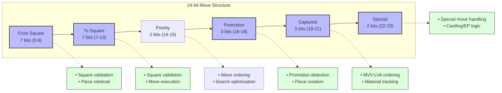

# Move Structure Design

## Overview

The eZ80 Chess move structure is designed to efficiently encode chess moves using the eZ80's native 24-bit word size. This document outlines the design decisions, memory layout, and usage patterns.

## Memory Layout

The move is encoded in a 24-bit integer with the following bit layout:

```
  23 22  | 21 20 19 | 18 17 16  |  15 14   | 13 12 11 10  9  8  7 |  6  5  4  3  2  1  0
---------+----------+-----------+----------+----------------------+---------------------
 Special | Captured | Promotion | Priority |     To Square        |     From Square
   (2)   |   (3)    |    (3)    |   (2)    |        (7)           |         (7)
```

### Field Descriptions

1. **From Square (7 bits)**: Source square in 0x88 representation (0-127)
   - Only values 0-119 are valid squares in the 16x8 board
   - 7 bits are sufficient as valid 0x88 indices never exceed 119

2. **To Square (7 bits)**: Destination square in 0x88 representation (0-127)
   - Same constraints as From Square

3. **Move Priority (2 bits)**: Pre-computed move ordering hints
   - 0: Normal move (lowest priority)
   - 1: Killer move (historical good move at this position)
   - 2: Capture move
   - 3: Hash move (highest priority, found in transposition table)

4. **Promotion Piece (3 bits)**: 

   |     |     |        | 
   | --- | --- | ------ |
   | 000 | (0) | None   |
   | 001 | (1) | Knight |
   | 010 | (2) | Bishop |
   | 011 | (3) | Rook   |
   | 100 | (4) | Queen  |

5. **Captured Piece (3 bits)**:

   |     |     |        | 
   | --- | --- | ------ |
   | 000 | (0) | None   |
   | 001 | (1) | Pawn   |
   | 010 | (2) | Knight |
   | 011 | (3) | Bishop |
   | 100 | (4) | Rook   |
   | 101 | (5) | Queen  |

6. **Special Move (2 bits)**:
   |     |     |                  | 
   | --- | --- | ---------------- |
   | 000 | (0) | None             |
   | 001 | (1) | En Passant       |
   | 010 | (2) | Kingside Castle  |
   | 011 | (3) | Queenside Castle |

## Design Rationale

### Word Size Optimization

The 24-bit structure is chosen to match the eZ80 processor's native word size, allowing:
- Efficient storage and manipulation
- No wasted bits in memory structures
- Single-instruction operations on the entire move

### Field Size Decisions

- **7 bits for squares**: Sufficient to represent all valid squares in the 0x88 board (0-119)
- **2 bits for move priority**: Enables quick move ordering without recomputation during search
- **3 bits for pieces**: Sufficient to represent all piece types (excluding kings which are never captured or promoted to)
- **2 bits for special moves**: Encodes the three special move types with a non-special default

### Optimizing the Square Representation

While the 0x88 board uses a 16×8 array structure, it was discovered that:
- The highest valid square index is 119 (position h1)
- This requires only 7 bits (0-127) to represent, not 8 bits
- This optimization freed 2 bits (1 from each square) that we repurposed for move ordering hints

The move priority field is a particularly valuable addition since move ordering is critical for alpha-beta pruning efficiency. Pre-computing and storing priorities saves significant computation time during the search process.

### Move Type Inference

Unlike earlier designs, this structure does not use explicit move type flags. Instead, move types are inferred losslessly from the content:
- Capture: Captured piece != 0
- Promotion: Promotion piece != 0
- Special: Special move != 0
- Quiet: All fields except from/to squares are 0

This approach saves bits while maintaining clear semantics. In tight loops (like move generation, search, and sorting), move type inference will generally be more time-efficient than explicit flags anyway.

## Usage in Search Performance

### Move Generation Benefits

- Single-word move creation improves generation speed
- Field isolation via bit masks is fast on eZ80
- Direct encoding of capture victims saves board lookups during sorting

### Move Ordering Optimization

The structure directly encodes information critical for move ordering heuristics:
- **2-bit priority field** for immediate classification without computation
- Captured piece type for MVV-LVA ordering
- Promotion piece type for scoring promotions
- Special move flags for prioritizing tactical moves

This pre-computed priority is particularly valuable during search:
```c
void sort_moves(move_t* moves, int count) {
    // Simple insertion sort prioritizing by the built-in priority field
    for (int i = 1; i < count; i++) {
        move_t key = moves[i];
        int priority = (key & MOVE_PRIORITY_MASK) >> MOVE_PRIORITY_SHIFT;
        int j = i - 1;
        
        // Moves with higher priority values come first
        while (j >= 0 && 
              ((moves[j] & MOVE_PRIORITY_MASK) >> MOVE_PRIORITY_SHIFT) < priority) {
            moves[j + 1] = moves[j];
            j--;
        }
        moves[j + 1] = key;
    }
}
```

By encoding priority directly in the move, we avoid:
- Recalculating move scores during ordering
- Maintaining a separate score array
- Extra memory accesses during sorting

### Transposition Table Efficiency

- The entire move fits in one word in the transposition table entry
- No need to decompose/recompose when storing or retrieving

## Alternative Designs Considered

### 32-bit Structure
- Would provide more space for additional flags
- Rejected due to inefficiency on eZ80 (requiring 2-word operations)

### Separate Move Type Field
- Earlier design used 2 bits for explicit move types
- Eliminated to reduce redundancy and save bits

### Explicit Struct with Bitfields
- Appears more readable, simpler access semantics
- Discarded due to probable alignment padding, move copy costs, and sorting overhead

## Conclusion

The 24-bit move structure balances memory efficiency with computational performance, making optimal use of the eZ80's native word size while providing all necessary information for move generation, execution, and search optimization.

