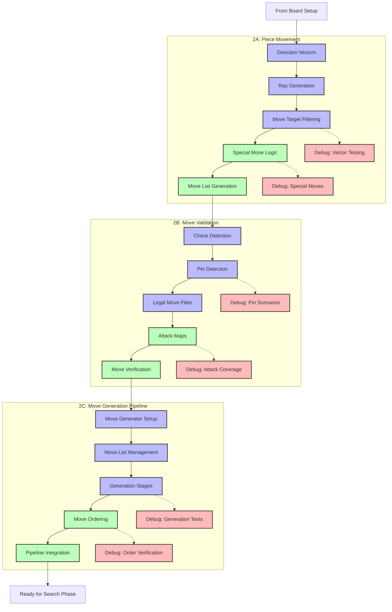

```mermaid
flowchart TD
    subgraph "2A: Piece Movement"
        A1[Direction Vectors] --> A2[Ray Generation]
        A2 --> A3[Move Target Filtering]
        A3 --> A4[Special Move Logic]
        A4 --> A5[Move List Generation]
        
        A3 -.-> D1[Debug: Vector Testing]
        A4 -.-> D2[Debug: Special Moves]
    end

    subgraph "2B: Move Validation"
        B1[Check Detection] --> B2[Pin Detection]
        B2 --> B3[Legal Move Filter]
        B3 --> B4[Attack Maps]
        B4 --> B5[Move Verification]
        
        B2 -.-> D3[Debug: Pin Scenarios]
        B4 -.-> D4[Debug: Attack Coverage]
    end

    subgraph "2C: Move Generation Pipeline"
        C1[Move Generator Setup] --> C2[Move List Management]
        C2 --> C3[Generation Stages]
        C3 --> C4[Move Ordering]
        C4 --> C5[Pipeline Integration]
        
        C3 -.-> D5[Debug: Generation Tests]
        C4 -.-> D6[Debug: Order Verification]
    end

    Phase1[From Board Setup] --> A1
    A5 --> B1
    B5 --> C1
    C5 --> Next[Ready for Search Phase]

    classDef implementation fill:#bbf,stroke:#333,stroke-width:2px,color:#333
    classDef debug fill:#fbb,stroke:#333,stroke-width:2px,color:#333
    classDef console fill:#bfb,stroke:#333,stroke-width:2px,color:#333
    
    class A1,A2,A3,B1,B2,B3,C1,C2,C3 implementation
    class D1,D2,D3,D4,D5,D6 debug
    class A4,A5,B4,B5,C4,C5,D7,D8 console
```