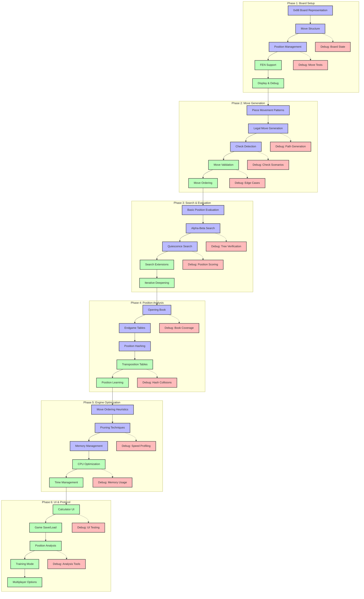

```mermaid
flowchart TD
    subgraph "Phase 1: Board Setup"
        B1[0x88 Board Representation] --> B2[Move Structure]
        B2 --> B3[Position Management]
        B3 --> B4[FEN Support]
        B4 --> B5[Display & Debug]
        
        B2 -.-> BD1[Debug: Board State]
        B3 -.-> BD2[Debug: Move Tests]
    end

    subgraph "Phase 2: Move Generation"
        M1[Piece Movement Patterns] --> M2[Legal Move Generation]
        M2 --> M3[Check Detection]
        M3 --> M4[Move Validation]
        M4 --> M5[Move Ordering]
        
        M2 -.-> MD1[Debug: Path Generation]
        M3 -.-> MD2[Debug: Check Scenarios]
        M4 -.-> MD3[Debug: Edge Cases]
    end

    subgraph "Phase 3: Search & Evaluation"
        S1[Basic Position Evaluation] --> S2[Alpha-Beta Search]
        S2 --> S3[Quiescence Search]
        S3 --> S4[Search Extensions]
        S4 --> S5[Iterative Deepening]
        
        S2 -.-> SD1[Debug: Tree Verification]
        S3 -.-> SD2[Debug: Position Scoring]
    end

    subgraph "Phase 4: Position Analysis"
        P1[Opening Book] --> P2[Endgame Tables]
        P2 --> P3[Position Hashing]
        P3 --> P4[Transposition Tables]
        P4 --> P5[Position Learning]
        
        P1 -.-> PD1[Debug: Book Coverage]
        P4 -.-> PD2[Debug: Hash Collisions]
    end

    subgraph "Phase 5: Engine Optimization"
        O1[Move Ordering Heuristics] --> O2[Pruning Techniques]
        O2 --> O3[Memory Management]
        O3 --> O4[CPU Optimization]
        O4 --> O5[Time Management]
        
        O2 -.-> OD1[Debug: Speed Profiling]
        O4 -.-> OD2[Debug: Memory Usage]
    end

    subgraph "Phase 6: UI & Protocol"
        U1[Calculator UI] --> U2[Game Save/Load]
        U2 --> U3[Position Analysis]
        U3 --> U4[Training Mode]
        U4 --> U5[Multiplayer Options]
        
        U1 -.-> UD1[Debug: UI Testing]
        U3 -.-> UD2[Debug: Analysis Tools]
    end

    B5 --> M1
    M5 --> S1
    S5 --> P1
    P5 --> O1
    O5 --> U1

    classDef core fill:#bbf,stroke:#333,stroke-width:2px,color:#333
    classDef debug fill:#fbb,stroke:#333,stroke-width:2px,color:#333
    classDef feature fill:#bfb,stroke:#333,stroke-width:2px,color:#333
    
    class B1,B2,B3,M1,M2,M3,S1,S2,S3,P1,P2,P3,O1,O2,O3 core
    class BD1,BD2,MD1,MD2,MD3,SD1,SD2,PD1,PD2,OD1,OD2,UD1,UD2 debug
    class B4,B5,M4,M5,S4,S5,P4,P5,O4,O5,U1,U2,U3,U4,U5 feature
```